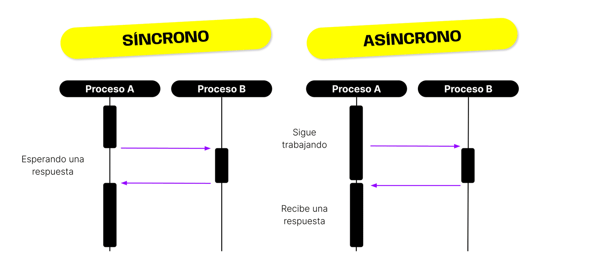
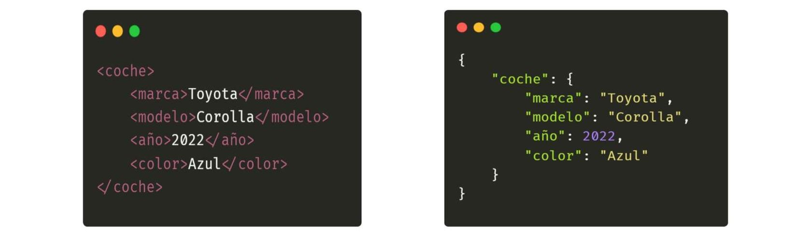
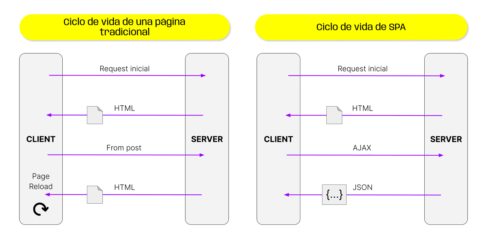

> # ***Modulo 2 - Clase 2: AJAX***

> ## ***Objetivos***

* ### *Aprender cómo funciona el manejo de procesos asincrónicos en Javascript.*

* ### *Comprender cómo funciona AJAX.*

* ### *Entender qué son y cómo funcionan los callbacks en un contexto asincrónico.*

> ## ***Asincronismo***

* ### **¿Qué es?**
    
    Alrededor del año 2000, cuando el internet empezaba a tomar fuerza, las nociones que se tenían de programación cambiaron de forma radical.

    Las aplicaciones y programas que antes estaban disponibles únicamente de forma local en el dispositivo, ahora debían contemplar la posibilidad de enviar y recibir información de manera remota mediante la comunicación entre un cliente y un servidor.

    Este proceso de envío y recepción de información requiere de un manejo de procesos asíncronos dentro del código que se ejecuta.

  * ***Sincronismo:*** Las tareas que lleva un dispositivo a la hora de ejecutar un programa se procesan de forma secuencial, es decir, una proceso después del otro. Esto indica que cada instrucción se ejecuta y completa antes de continuar con la nueva tarea. JavaScript, así como otros lenguajes, es sincrónico por naturaleza.

  * ***Asincronismo:*** El asincronismo es la capacidad que tiene un lenguaje de realizar otras operaciones mientras una operación se ejecuta en segundo plano.  
    
    #### **En los procesos asincrónicos se distinguen varias características:**  
    
    1. ***Inicio de la tarea:*** Cuando se inicia una tarea asíncrona el programa no espera su finalización.

    2. ***Continuación inmediata:*** Luego de iniciar la tarea, el programa continúa ejecutando otras tareas sin esperar a que la tarea asíncrona se complete.

    3. ***Manejo del resultado:*** Cuando la tarea asíncrona se completa, se maneja el resultado o se ejecuta una función de retorno (callback) para procesar el resultado.

    

### *El objetivo del enfoque asincrónico es simplemente que un programa pueda mejorar su eficiencia y capacidad de respuesta, evitando que se generen procesos bloqueantes a partir de operaciones que toman mucho tiempo (como la lectura de archivos, las solicitudes de red o las operaciones de entrada/salida) y continuar realizando otros procesos en un “segundo plano”, en lugar de quedarse inactivo.*

> ## ***AJAX (Asynchronous JavaScript and XML)***

Debido a la necesidad de procesar asincronismo en las solicitudes y respuestas en el manejo de información a través de la red, se dio lugar a la implementación de una técnica de desarrollo denominada como AJAX (Asynchronous JavaScript and XML).  

AJAX se utiliza para darle funcionalidades y permitir interacción en una página web. Permite realizar procesos asincrónicos.  

¡AJAX NO es una tecnología por sí misma! Es un término que describe un modo de utilizar varias tecnologías existentes, incluyendo HTML, DOM, CSS, JavaScript, XML y el objeto XMLHttpRequest.

> ## ***XML (Extensible Markup Language)***

* ### **¿Qué es?**

    Extensible Markup Language o XML, es un lenguaje de marcado (similar a HTML) que se usa para almacenar e intercambiar información. Se basa en etiquetas que describen la estructura y el significado de los datos.  

    AJAX se utiliza para darle funcionalidades y permitir interacción en una página web. Permite realizar procesos asincrónicos.  

    Si bien las siglas de AJAX hacen ilusión a que solo se utiliza XML para hacer un intercambio de datos, en la práctica se pueden utilizar otros formatos.

    ```XML
    <Persona>
        <Nombre>Juan</Nombre>
        <Edad>30</Edad>
        <Direccion>
            <Ciudad>Buenos Aires</Ciudad>
            <CodigoPostal>12345</CodigoPostal>
        </Direccion>
    </Persona>
    ```

> ## ***JSON (JavaScript Object Notation)***

* ### **¿Qué es?**
    JSON (JavaScript Object Notation) estructura la información con pares clave-valor (como los objetos de JavaScript), donde las claves son cadenas y los valores pueden ser cualquier otro tipo de dato.

    ```JSON
    {
      "Persona": {
        "Nombre": "Juan",
        "Edad": 30,
        "Direccion": {
          "Ciudad": "Buenos Aires",
          "CodigoPostal": 12345
        }
      }
    }
    ```

> ## ***Diferencias entre XML y JSON***

|       | XML | JSON |
|:-----:|:---:|:----:|
| Sintaxis | Más verbosa y basada en etiquetas con apertura y cierre | Más concisa basada en pares clave-valor |
| Legibilidad | Más difícil de leer debido a su estructura de etiquetas | Más legible debido a la simpleza de su estructura |
| Anidamiento |  Permite anidamiento profundo de elementos | También permite anidamiento siendo más fácil de leer debido a su sintaxis |



Las aplicaciones web tradicionales solían requerir una recarga completa de la página cada vez que se realizaba una solicitud al servidor. AJAX permite enviar y recibir datos del servidor en segundo plano, sin interferir con la interacción del usuario en la página. Esto mejora la experiencia del usuario al proporcionar respuestas más rápidas y fluidas.



> ## ***[JSON Placeholder](https://jsonplaceholder.typicode.com/)***

Antes de planificar la forma en que deseamos traer la información, primero es necesario entender qué recibiremos como resultado de la consulta. Si visitamos la página web encontraremos una API pública que contiene recursos relacionados con usuarios, posts, etc. 

* ### **¿Qué es?**
    
    Esta API (JSON Placeholder) está enfocada únicamente al consumo y lectura de información, por lo que solo aceptará solicitudes de tipo GET con cualquiera de los endpoints con los que trabajemos.

> ## ***[JSON Formatter](https://chromewebstore.google.com/detail/json-formatter/bcjindcccaagfpapjjmafapmmgkkhgoa?pli=1)***

Si quieres visualizar la información JSON de tu navegador de una forma más amigable, te recomendamos instalar esta extensión.

> ## ***Callbacks***

* ### **¿Qué es?**
    Los callbacks son funciones que se pasan como argumentos a otras funciones y se ejecutan después de que se complete la operación.

    ```javascript
    function operacion(a, b, callback) {
      const resultado = a + b;

      callback(resultado);
    }

    let funcionCallback = function (resultado) {
      console.log(`El resultado es: ${resultado}`);
    };

    operacion(5, 3, callback); // El resultado es: 8
    ```
***