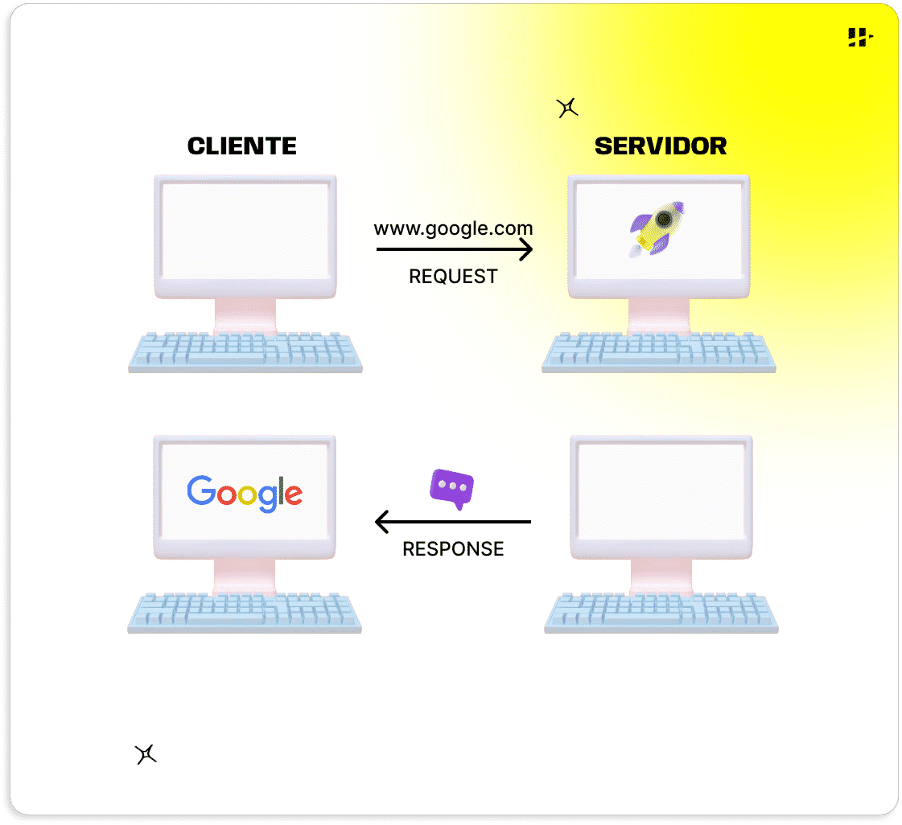
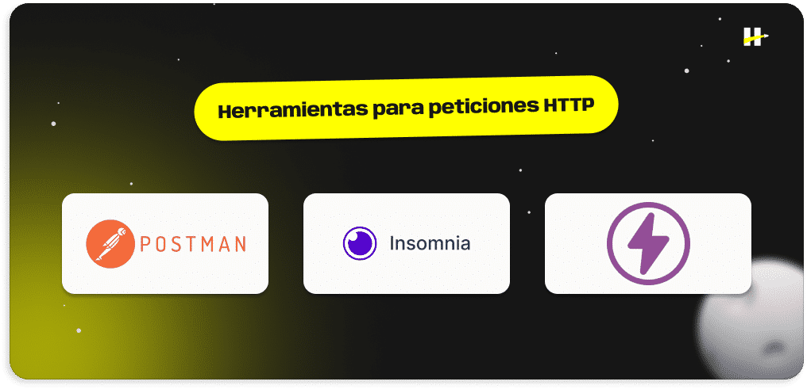
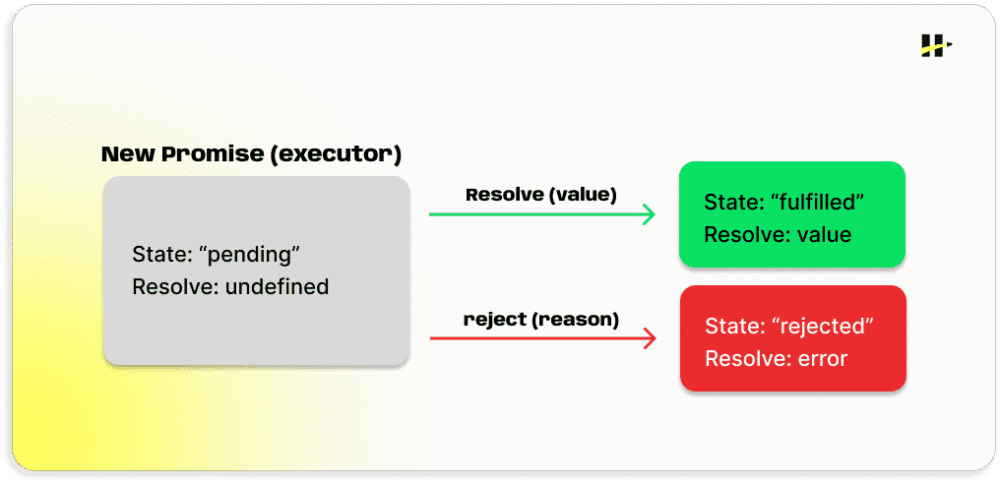
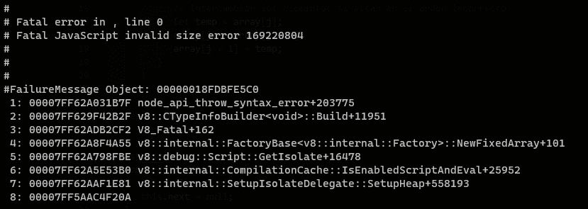
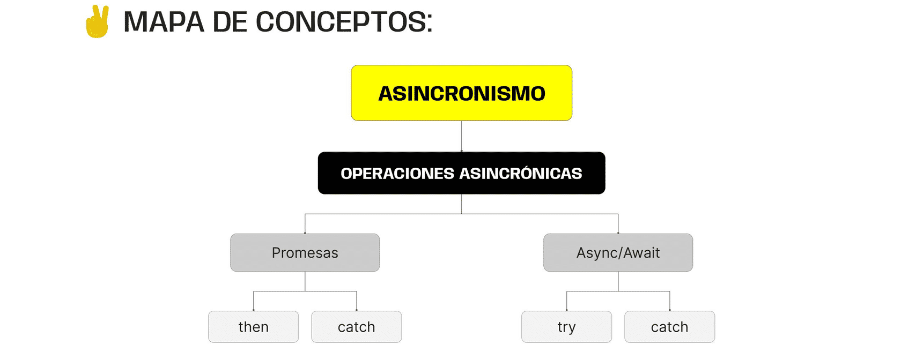

> # ***Modulo 2 - Clase 6: Asincronismo***

> ## ***Objetivos***

* ### *Familiarizar al alumno con la comunicación a través del protocolo HTTP, realizando prácticas en distintas herramientas.*

* ### *Profundizar en la idea de asincronismo y presentar nuevas estrategias para el manejo de operaciones asincrónicas.*

* ### *Presentar otro tipo de operaciones asincrónicas: lectura de archivos, consultas de BDDs, etc.*

> ## ***Práctica de peticiones HTTP***

* ### **Peticiones HTTP desde el navegador**
  
  Como mencionamos anteriormente, HTTP es un protocolo de comunicación entre un cliente (alguien que solicita algo) y un servidor (quien provee al cliente de aquello que ha solicitado). HTTP no hace más que establecer las reglas y la estructura sobre las cuales se dará esta comunicación.

* ### **Cliente y servidor**
  
  Siempre que introduces una url en tu navegador estás realizando una solicitud bajo el protocolo HTTP. En este caso, tu navegador es el cliente porque es quien está solicitando información, y el servidor es otra computadora remota, que recibirá esta solicitud y responderá al cliente con lo que este ha solicitado. Por ejemplo, un archivo de HTML, CSS y JavaScript el cual llegará a nuestro navegador para ser interpretado y mostrado en la pantalla.

  El protocolo HTTP no se trata de un protocolo de comunicación directamente relacionado a JavaScript, dado que no está sujeto a ningún lenguaje o librería específico.

  * #### ***HTTP es un protocolo de comunicación cliente / servidor.***

  * #### ***El cliente es quien solicita un recurso o una acción al servidor.***

  * #### ***El servidor es quien recibe dicha solicitud y actúa en consecuencia, siempre enviando una respuesta al cliente...***  
    #### ***... incluso cuando hay un error.***

    

* ### **API Testing tools**

  Existen herramientas que permiten enviar solicitudes HTTP a un servidor a través de una API para determinar qué respuestas funcionan correctamente. Sabremos así qué información estamos obteniendo desde el servidor y de qué manera la usamos en el lado cliente.

  Postman, Insomnia y ThunderClient, hacen parte de dichas herramientas que, además de ser gratuitas, poseen ciertas características particulares para trabajar las consultas de una forma más eficiente.

  

> ## ***Promesas***

* ### **¿Qué es?**

  En JavaScript las promesas son estructuras de datos. Es decir, un objeto que representa el resultado eventual de una operación asincrónica. Dicho resultado puede ser evaluado con éxito o como un fracaso y, dependiendo de ese resultado, se podrá decidir qué hacer a continuación.

  Una promesa va a reservar un lugar en el código para una acción o respuesta que aún no ocurre o de la cual aún no se recibe una respuesta, pero que una vez ocurra, el código sabrá que hacer con esa “respuesta”.

  Para generar promesas contamos con una estructura nativa llamada Promise de la cual podemos instanciar promesas utilizando la palabra clave new. Esta promesa recibe como argumento una función la cual a su vez toma dos funciones como parámetros...

* ### **Estados de una promesa**

  * ***Pending:*** El estado pending corresponde al estado inicial de una promesa. Todas las promesas mantienen este estado hasta el momento en el que se ejecuta la operación asincrónica.

  * ***Fulfilled:*** Una vez se completa la operación y se evalúa de forma exitosa, la promesa se resuelve a un valor asociado a dicha operación y su estado cambia a “fulfilled”.

  * ***Rejected:*** En caso de fallar la operación, la promesa se rechaza a una razón y su estado cambia a “rejected”.

  ```javascript
  const promesa = new Promise((resolve, reject) => {
    // ...
  });

  console.log(promesa); //Output: Promise { <pending> }
  ```

    

* ### **Metodos then((value) => { ... })   |   catch((error) => { ... })**

  * ***then:*** Maneja la lógica en caso de que una promesa haya sido resuelta. Se le proporciona una función que recibe el valor de la resolución como argumento y se ejecutará cuando la promesa se complete exitosamente.

  * ***catch:*** Maneja la lógica en caso de que una promesa haya sido rechazada. Se le proporciona una función que recibe la razón del rechazo como argumento y se ejecutará cuando la promesa se rechace, permitiendo manejar el rechazo o error.

> ## ***Async/Await***

* ### **¿Qué es?**
  
  Async/Await es una característica de JavaScript creada para simplificar nuestro código asincrónico. Viene a "reemplazar" las promesas y proporciona una forma resumida de procesar su resolución, evitando la encadenación de métodos como then() y catch().

  ```javascript
  async function miFuncionAsync () {
    const miProcesoAsync = await //proceso asincrono(Lectura/escritura de datos, conexion a BDD, request a una API, etc...)
  }
  ```

* ### **Try/Catch**

  Dentro de las funciones async, utilizamos un bloque llamado try/catch para el manejo de errores. Este bloque se utiliza para capturar y gestionar errores que podrían ocurrir.

  El bloque try contendrá el código que queremos ejecutar. En caso de ocurrir un error, cancelará la ejecución de este bloque e irá directo a ejecutar al bloque catch para manejar el error.

  ```javascript
  try { 
    // El bloque Try es el que intentará ejecutar primero JavaScript.
    async function miFuncionAsync () {
      const miVariable = await //proceso asincrono(Lectura/escritura de datos, conexion a BDD, request a una API, etc...)
    }
  } catch (error) { 
    // Si el bloque Try lanza un error durante su ejecución el bloque catch lo captura para poder trabajar con el.
    console.log(error.message)
  }
  ```

> ## ***Axios***

* ### **¿Qué es?**
  
  Como ya mencionamos, al igual que fetch, Axios es utilizada para realizar solicitudes HTTP en JavaScript. Pero a diferencia de ésta, es más simple. Veremos que simplifica muchas funciones y también automatiza la conversión de datos JSON a objetos de JavaScript.

  Para inicializar una función asíncrona, es necesario anteponer la palabra clave async al declarar la función. Esto le indicará a JavaScript que la función va a trabajar con código asincrónico para evitar que la lectura del resto del código se detenga.

  Dentro del bloque de la función asíncrona tendremos acceso a un operador especial llamado await que le indicará al intérprete que debe esperar a que se resuelva la promesa antes de continuar con la ejecución.

* ### Características
  
  * ***Sintaxis simple y consistencia:*** Nos proporciona una escritura simple para realizar solicitudes.

  * ***Manejo de promesas:*** Axios está basado en promesas, lo que facilita su integración con
  async/await y manejo de errores.

* ### Métodos
  
  * ***axios.get(url) / axios(url):*** Realiza una solicitud de tipo GET que permite obtener los datos de una API.
    
    ```javascript
    axios.get('https://api.example.com/data')
    .then(response => {
      console.log('Respuesta GET:', response.data);
    })
    .catch(error => {
      console.error('Error al realizar la petición GET:', error);
    });
    ```
  
  * ***axios.post(url):*** Ejecuta una solicitud de tipo POST permitiendo enviar datos en el cuerpo de la solicitud (por ejemplo, al enviar un formulario).
    
    ```javascript
    const newData = {
      name: 'Ejemplo',
      age: 25,
      email: 'ejemplo@example.com'
    };

    axios.post('https://api.example.com/data', newData)
      .then(response => {
        console.log('Respuesta POST:', response.data);
    })
      .catch(error => {
        console.error('Error al realizar la petición POST:', error);
    });
    ```
  
  * ***axios.put(url):*** Efectúa una solicitud de tipo PUT para enviar datos al servidor y actualizar un recurso existente.
    
    ```javascript
    const updatedData = {
      name: 'Nuevo Nombre',
      age: 30,
      email: 'nuevo@example.com'
    };

    axios.put('https://api.example.com/data/1', updatedData)
      .then(response => {
        console.log('Respuesta PUT:', response.data);
    })
      .catch(error => {
        console.error('Error al realizar la petición PUT:', error);
    });
    ```
  
  * ***axios.delete(url):*** Hace una solicitud de tipo DELETE la cual se utiliza para eliminar un recurso existente.
    
    ```javascript
    axios.delete('https://api.example.com/data/1')
      .then(response => {
        console.log('Respuesta DELETE:', response.data);
    })
      .catch(error => {
        console.error('Error al realizar la petición DELETE:', error);
    });
    ```

> ## ***Otras operaciones de naturaleza asincrónica***

* ### **Veamos...**
  
  Ahora vamos a terminar de comprender qué otras operaciones asincrónicas podemos encontrar en JavasScript. Algunas muy comunes son las de lectura, escritura y creación de archivos, conexión a servicios y a bases de datos.

* ### File System
  
  El módulo “fs” es nativo de Node y facilita la interacción con el sistema de archivos de un dispositivo, permitiendo realizar operaciones como leer, escribir y eliminar archivos, leer y crear directorios, entre otras.

  ```javascript
  const fs = require("node:fs")

  fs.readfile("./mi_archivo.txt", "utf-8", (err, data) => {
    if (err) console.log(err)
    else console.log(data)
  });
  ```

> ## ***Debugging***

* ### **ERRORES**
  Existen tres formas en las que se pueden presentar un error en nuestro código

  * ***EXPLÍCITO:*** Muchas veces, cuando tenemos un error lo podremos ver reflejado en la terminal. Por ejemplo, con un error de sintaxis.
    

  * ***RESULTADO INESPERADO:*** Otras veces nuestro código funciona correctamente. El intérprete no detecta errores, ya que el error en realidad está en la lógica. Por ejemplo, una función que debería devolver un número devuelve NaN.
  
    ```javascript
    function calcularPromedio(numeros) {
      let suma = 0;
      for (var i = 0; i < numeros.length; i++) {
          suma += numeros[i];
      }
      return suma / numeros.length;
    };

    console.log(calcularPromedio([1, "dos", 3, "cuatro", 5])); // Output: NaN
    ```

  * ***SIN RESULTADOS:*** Puede ocurrir que nos encontremos en una situación en la que no tengamos un error explícito, y tampoco tengamos un resultado inesperado.  
  
    
***
> ## ***Cierre***

* ### **En conclusión...**

  * ***Exploramos conceptos fundamentales sobre el Asincronismo en JavaScript:*** Y su aplicación en prácticas comunes. Abordamos temas como peticiones HTTP utilizando fetch y la librería axios, y descubrimos que el asincronismo es fundamental para manejar nuestro código.

  * ***Pusimos en práctica el concepto de Promesas:*** Para representar el resultado de una operación asíncrona y cómo manejarlo. A su vez, revisamos el formato async/await como una nueva sintaxis para definir promesas. Ahondamos en los manejadores de promesas con los métodos then y catch para la forma tradicional, así como el uso de try/catch para la nueva sintaxis.

  * ***Realizamos algunas operaciones Asincrónicas:*** Como lectura/escritura de archivos y conexiones a servicios.

  
***