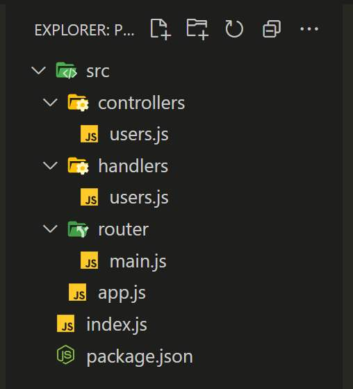
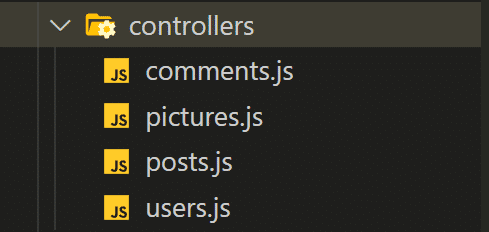
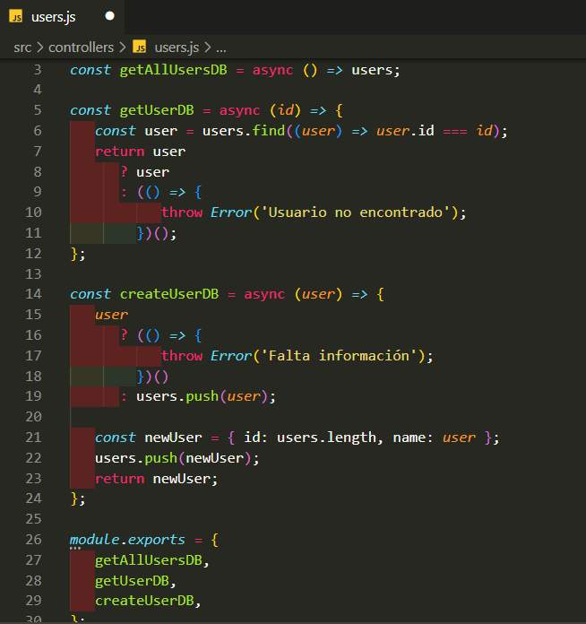
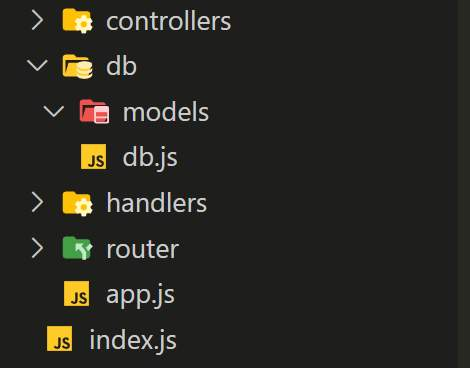
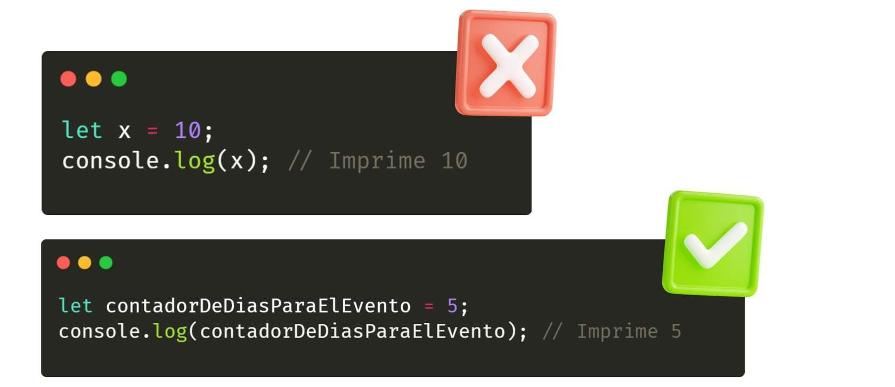
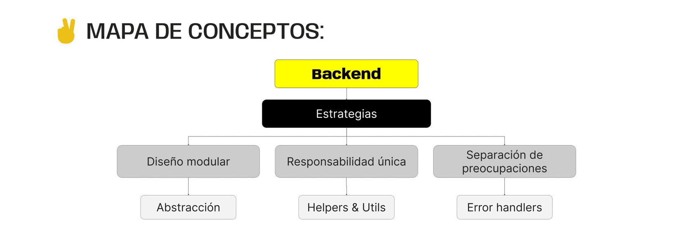

> # ***Modulo 2 - Clase 13: Backend Avanzado***

> ## ***Objetivos***

* ### *Comprender la importancia de la modularización en un proyecto backend.*

* ### *Aprender estrategias de manejo de errores.*

* ### *Conocer las funciones útiles y helpers para una mejor modularización del código.*

> ## ***Responsabilidad y modularización***

* ### **Responsabilidades**

    Cuando trabajamos en un proyecto, una de las principales tareas del desarrollador es mantener el código ordenado y legible sin importar la extensión de la aplicación. 

    El proceso de modularización y división de responsabilidades es la forma en la que el código se organiza y se divide en carpetas y archivos independientes, para facilitar su desarrollo, mantenimiento y escalabilidad. 

    Cada módulo encapsula una parte de la aplicación y, cada archivo, tendrá una única responsabilidad bien definida.

    Para ello, es necesario realizar una planificación del proyecto que nos permita ver a gran escala la estructura de nuestra aplicación.

* ### **Estrategias de modularización** ***[demoRepo](https://drive.google.com/file/d/1M9WY7QNAETEU167tku_r0v3iNpjqIzVU/view?usp=sharing)***

    * ***Diseño modular desde el principio:*** Identifica los componentes principales del sistema y cómo se relacionan entre sí.  
    Cada carpeta se encarga de encapsular un fragmento específico del código.  

        

    * ***Separación de preocupaciones:*** Divide tu código en módulos que se ocupen de preocupaciones específicas.  
    Esto facilita la comprensión y el mantenimiento del código. Es decir que, dentro de cada una de estas carpetas y archivos, se desarrollará la lógica específica para trabajar con un elemento de mi aplicación.

        
    
    * ***Principio de responsabilidad única:*** Cada archivo o módulo debe tener una responsabilidad única y bien definida.  
    Evita la sobrecarga de funcionalidades en un solo archivo y asegúrate de que, además, tenga un propósito claro. Así, cada uno de los módulos se encargará de contener la lógica enfocada a gestionar la información de un solo recurso, facilitando su manipulación y mantenimiento.

        
    
    * ***Jerarquía de archivos y carpetas:*** Organiza tus archivos y carpetas de manera lógica y coherente.  
    Cuando el proyecto sea cada vez más grande, será necesario incorporar nuevas herramientas y archivos a la aplicación, así que es fundamental definir la jerarquía para simplificar el manejo de información e importaciones entre módulos.

        

    * ***Nombres descriptivos:*** Utiliza nombres descriptivos y significativos para tus archivos y módulos.  
    Esto facilita la comprensión del propósito de cada uno de ellos y su relación con otros archivos en el proyecto.

        

    * ***Acoplamiento mínimo:*** Minimiza el acoplamiento entre módulos y archivos. Esto significa que los módulos deben tener la menor dependencia posible entre sí y comunicarse a través de definiciones claras y específicas.  
    Planifica la interacción entre módulos para minimizar las importaciones y exportaciones innecesarias.  
    Otra forma de asegurar que el acoplamiento entre módulos se realice de la manera más eficientemente posible, es por medio de la abstracción.

* ### **Abstracción**

    En el contexto de la modularización, la abstracción permite interactuar con un módulo sin necesidad de entender todos los detalles internos de su implementación.

    Su principal objetivo es simplificar el uso de una funcionalidad al exponer solo lo relevante, ocultando el resto de información más compleja.

    Este concepto puede parecer complejo, pero en la práctica es fácil de aplicar😉. De hecho lo hemos utilizado en diferentes ocasiones sin darnos cuenta.

> ## ***Manejo de errores***

* ### **¿Qué es?**

    Para garantizar el correcto funcionamiento y eficiencia de una aplicación, debemos identificar aquellas tareas susceptibles de provocar errores en algún momento. 

    Esta detección permite gestionar de manera adecuada cualquier tipo de error que pueda ocurrir durante la ejecución del código, con lo cual prevenimos que una aplicación se bloquee o genere comportamientos inesperados.

    Existen diversas alternativas y estrategias que nos permiten realizar este manejo de errores y pueden trabajar de manera conjunta o de forma independiente.

    Estas tienen como objetivo ejecutar una operación, ya sea de forma sincrónica o asincrónica, considerando los posibles casos de error para actuar en consecuencia y devolver información pertinente al cliente.

* ### **Estrategias para el manejo de errores**

    * ***Try / Catch:*** Envuelve la ejecución de una tarea propensa a errores dentro del bloque try, seguido del bloque catch, que capturará y manejará cualquier error dentro del bloque anterior.
        
        * **Usos:** Una de las implementaciones más frecuentes de esta herramienta es para el manejo de errores en funciones asíncronas lo cual nos brinda una alternativa para procesar la finalización de una promesa en caso de éxito o de rechazo.
    
    * ***Throw:*** Cuando el error que se genera es causado por el cliente, debido a una solicitud mal estructurada, aparece otra estrategia para el manejo de errores: el uso de throw.

        * **Usos:** Esta palabra clave nos permite lanzar errores explícitamente y se utiliza para crear condiciones específicas de error dentro del código, es decir, podemos personalizar el mensaje del error usando a throw.
    
    * ***Middlewares:*** Como vimos, son funciones que actúan como intermediarias en el flujo de una solicitud dentro de nuestro servidor, esto es, ocurren antes de llegar al endpoint de destino.

        * **Usos:** Una de las grandes aplicaciones de estos middlewares es el manejo de errores que pueden presentarse de forma repetitiva dentro del código y que pueden ser validados antes de que la solicitud llegue incluso al handler.

* ### **Express error handler**

    Express cuenta con un middleware de manejo de errores predeterminado de manera implícita que captura los errores que ocurren dentro de las rutas y otros middlewares de la aplicación.

    Para hacer uso del error handler de express solo es necesario agregarlo como middleware a nuestras rutas con la siguiente estructura.

    ```javascript
    app.use((err, req, res, next) => {
      // Manejo del error  
    });

    return go(f, seed, [])
    ```

    Este error handler se encarga de recibir los errores de las solicitudes y gestionarlos de acuerdo a lo que indiquemos en el bloque de código del middleware.

* ### **Funciones de Orden Superior**

    El concepto de función de orden superior se refiere a aquellas funciones que aceptan otras funciones como argumentos para usarlas en un bloque de lógica adicional. En nuestro caso, esa lógica adicional estará enfocada al manejo de errores en los handlers de nuestra aplicación.

    La idea general es crear una función de orden superior que se encargue de procesar los errores de nuestros handlers de forma “genérica”, permitiendo planificar el manejo de errores dentro de una sola función en lugar de hacerlo en cada handler. 

    La estructura general es una función que recibe como argumento otra función asíncrona y la ejecuta dentro del manejo de errores que definamos, como un try/catch.

> ## ***Utils y helpers***

* ### **¿Qué es?**

    Estos términos se refieren a funciones o grupo de funciones que proporcionan utilidades auxiliares. Realizan tareas comunes, y en ocasiones repetitivas, para facilitar ciertas operaciones dentro de nuestros proyectos.

    En realidad, no existe una diferencia definitiva entre ambos conceptos y en ocasiones se utiliza una sola categoría dependiendo del equipo de desarrollo, ya que ambos términos se refieren a funciones o utilidades genéricas o auxiliares.

    | Helpers | Utils |
    |:-------:|:-----:|
    |Están enfocados en almacenar funciones auxiliares para una tarea específica dentro de la aplicación.| Estos trabajan con implementaciones más genéricas.

* ### **Casos de uso y ejemplo**

    En general los utils y helpers pueden utilizarse para manipulación de strings, operaciones matemáticas, formateo de datos, manejo de fechas y en particular en el manejo de errores.
***
> ## ***Cierre***

* ### **En conclusión...**

    * ***Hemos visto las diferentes estrategias para estructuras de Proyectos:*** Escalable y sólida, de nuestras carpetas y archivos, teniendo en cuenta recomendaciones como lo son el diseño modular, la responsabilidad única y la separación de preocupaciones.

    * ***Conocimos cómo funciona la Abstracción:*** Y de qué manera nos facilita interactuar con módulos, sin conocer en profundidad cómo estos trabajan internamente. Esto es lo que está detrás de muchas librerías y frameworks.

    * ***Descubrimos algunas herramientas para el manejo de Errores:*** Que puedan ocurrir en nuestras aplicaciones y cómo implementarlas de manera eficiente. Cada una de ellas tiene características particulares y nos permiten personalizar su implementación según nuestras necesidades o las del proyecto.

    * ***Exploramos el uso de los llamados helpers y utils:*** Carpetas que contendrán funciones que nos permiten trabajar con tareas específicas en partes de código concretos o tareas más generales que pueden llevarse a cabo en cualquier lugar de nuestra aplicación, respectivamente.

    
***