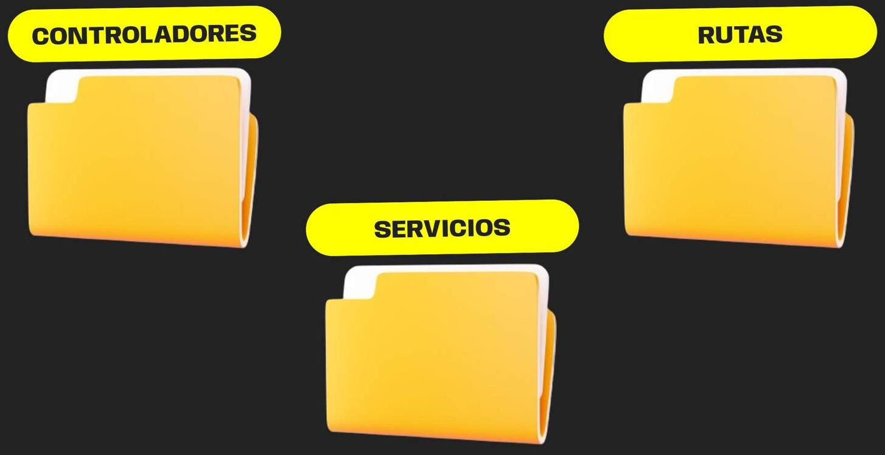
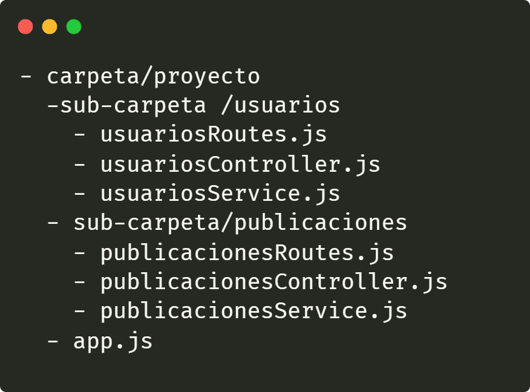
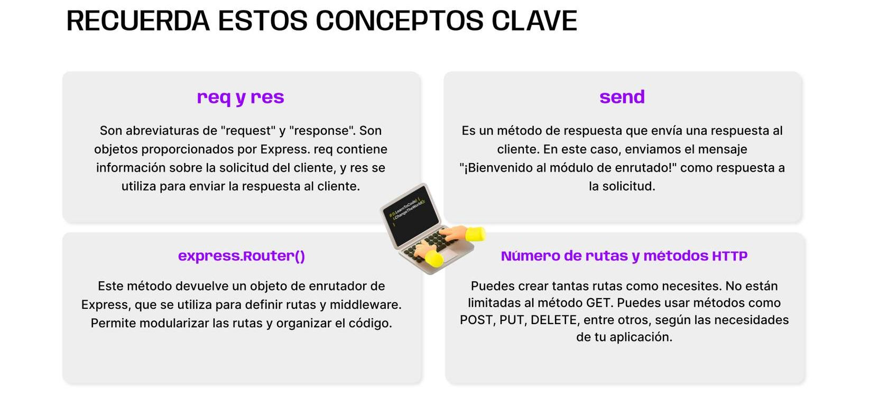
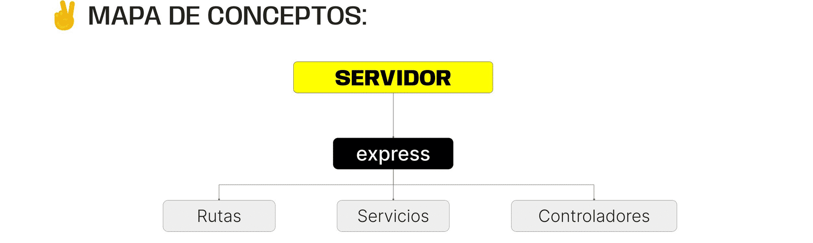

> # ***Modulo 2 - Clase 7: Express***

> ## ***Objetivos***

* ### *Conocer los fundamentos de Express, comenzando por la comprensión de la estructura básica de un servidor HTTP.*

* ### *Explorar el proceso de creación y configuración del proyecto mediante el uso eficiente del scaffolding.*

* ### *Profundizar en la implementación práctica del servidor HTTP utilizando Express y abordar el concepto esencial de controlador y enrutado.*

> ## ***Estructura Básica de Servidor***

* ### **Recordemos a HTTP...**

  Recordemos que HTTP es el lenguaje que permite a los navegadores y servidores compartir información a través de internet.

  Cuando buscas algo en internet lo que está sucediendo por detrás de todo es que tu navegador envía un pedido de información a un servidor. Este le responderá con la información solicitada o con un error correspondiente.

  Ese pedido (request) y respuesta (response) de información es lograda gracias a el protocolo HTTP.

* ### **Comprendamos la estructura**

  #### **Host y Puerto**

  * ***Host:*** En términos sencillos, el “localhost” es un identificador de ubicación de un recurso en la red. Puede ser una dirección IP numérica o un nombre de dominio, como "www.ejemplo.com". El host indica dónde se encuentra el servidor que aloja la aplicación o el recurso al que se está intentando acceder.

  * ***Puerto:*** El puerto es como una puerta específica en el servidor. Se utiliza para distinguir diferentes servicios o aplicaciones que se ejecutan en el mismo host. Mientras que el host te dice dónde encontrar el servidor, el puerto te dice a qué "puerta" debes llamar para acceder a un servicio específico en ese servidor.

  #### **Controladores**

  Dentro del servidor existen los "controladores" que se encargan de recibir el pedido y darle una respuesta. Por ejemplo, enviar información, eliminar un dato, o crear un nuevo registro.

  #### **Servicios**

  Los servicios se encargan de tomar un pedido y llevarlo al controlador adecuado: el encargado de esa ruta específica. Este controlador prepara la respuesta.

  Así, cada servicio tiene su propia responsabilidad y se organiza para manejar un aspecto particular de la aplicación (solicitudes de usuario, autenticación, interacción con base de datos). Los servicios se utilizan para descomponer la lógica de la aplicación en partes más pequeñas y manejables, lo que facilita la escalabilidad, el mantenimiento y la colaboración entre equipos de desarrollo.

  #### **Middlewares**
  
  Dentro de un servidor podemos encontrar, por ejemplo, cuando queremos enviar una serie de datos al cliente, no como viene desde la base de datos sino con un formato en particular.

> ## ***Scaffolding de proyecto***

* ### **Estructura de servidor de express**

  Una de las características de express es su flexibilidad, ya que la documentación no especifica una estructura de carpetas "ideal". Por ello, es posible contar con diferentes variantes en la organización de carpetas.

  Vamos a enfocarnos en cómo dar forma a nuestro proyecto a través del scaffolding. Vamos a crear una estructura de carpetas para organizar nuestro código de manera eficiente.

  Esta estructura se basará en 3 carpetas principales.

  

  
  ***IMPORTANTE:*** Las carpetas "rutas" y "controladores" son comúnmente utilizadas en patrones de diseño MVC (Modelo-Vista-Controlador) y en el contexto de desarrollo web para organizar y estructurar el código de una manera clara y mantenible.

* ### Variante de enfoques

  Existen variantes de cómo estructurar las carpetas y archivos de nuestros proyectos. Cada variante tiene su propia filosofía y ventajas. Puedes elegir la que mejor se adapte a tus necesidades y preferencias.

  * #### ***Enfoque Funcional*** 
    
    Organizas tu proyecto en carpetas que representan características específicas del proyecto, como 'usuarios', 'publicaciones', etc.
  
      
   
    En este ejemplo, cada carpeta representa una característica principal del proyecto y contiene archivos relacionados con esa característica, como rutas, controladores y servicios específicos para usuarios o publicaciones.

  * #### ***Enfoque Modular*** 
    
    Organizas tu proyecto en carpetas que representan roles o componentes clave, como 'rutas', 'controladores' y 'servicios'. Las carpetas contienen archivos que se centran en una función específica, como definir rutas, manejar la lógica de negocio en controladores o gestionar servicios compartidos.
  
      
   
    En este ejemplo, las carpetas están organizadas por roles o componentes clave, como rutas, controladores y servicios. Cada carpeta contiene archivos que se centran en una función específica, proporcionando flexibilidad y mantenimiento.

> ## ***Creación De Servidor***

* ### **Express: ¿Por qué aprenderlo?**

  1. #### *Facilita el manejo de rutas, simplificando la creación y gestión de rutas en nuestra aplicación.*
  
  2. #### *Introduce el concepto de middleware para funciones adicionales como autenticación o gestión de errores.*
  
  3. #### *Ahorra tiempo con middlewares integrados para tareas comunes como manejo de sesiones y cookies.*
  
  4. #### *Cuenta con una amplia comunidad y sólida documentación.*
  
  5. #### *Ofrece escalabilidad y flexibilidad para proyectos en crecimiento.*

* ### **Puntos importantes**

  * #### ***Puerto 3000***  
    
    Este puerto es comúnmente utilizado durante el desarrollo local de servidores. No está reservado para ningún servicio específico.  
  
    En resumen, al "abrir el puerto 3000", estamos permitiendo que nuestro servidor de express escuche las solicitudes entrantes en ese puerto específico. Esto nos permite interactuar con nuestra aplicación a través de la URL <http://localhost:3000> en un navegador web.

    ```javascript
    const PORT = 3000;
    ```

  * #### ***Metodo Listen***  
    
    El método listen que has visto en el ejemplo, es utilizado en express para iniciar un servidor y que este "escuche" las solicitudes HTTP en un puerto específico.

    * ***Puerto:*** Número del puerto en el que el servidor escuchará las solicitudes.

    * ***Callback:*** Función opcional que se ejecuta cuando el servidor se inicia correctamente.

    ***Nota***: El callback es útil para realizar acciones específicas después de que el servidor se ha iniciado correctamente. En el ejemplo, utilizamos un console.log para imprimir un mensaje indicando que el servidor está escuchando en un puerto específico.

    ```javascript
    server.listen(PORT, callback);
    ```

    En resumen, el método listen es fundamental para iniciar un servidor con express. El callback que recibe es opcional, pero útil para acciones posteriores al inicio.

> ## ***Controladores***

* ### **¿Qué es?**

  Un controlador es una función que maneja las solicitudes HTTP, llevando a cabo la lógica necesaria y enviando una respuesta al cliente. Estos controladores estarán ligados a una (o más) ruta que es la que recibe el pedido o request del cliente.

* ### **Funciones y responsabilidades típicas**

  * ***Procesamiento de datos:*** Un controlador puede procesar datos de la solicitud, como parámetros de ruta o datos del cuerpo.

  * ***Interacción con modelos:*** Puede interactuar con modelos (representación de datos) para realizar operaciones en la base de datos.

  * ***Generación de respuestas:*** Un controlador crea y envía respuestas al cliente, ya sea HTML, JSON u otros formatos.

  * ***Manejo de errores:*** Puede contener lógica para manejar errores y enviar respuestas adecuadas.

  * ***Redirecciones:*** Puede redirigir a otras rutas o URLs según la lógica de la aplicación.

### En resumen, un controlador en express maneja solicitudes HTTP y ejecuta lógica específica de la aplicación.

> ## ***Enrutado***

* ### **¿Qué es?**

  El enrutado es un componente de express que se encarga de gestionar las rutas de nuestra aplicación. Su propósito principal es actuar como un canalizador de solicitudes, dirigiéndolas hacia controladores específicos encargados de darles una respuesta.

  * #### ***Enrutado*** 
    
    Creamos un enrutador utilizando express.Router(). Este enrutador será responsable de manejar todas las rutas relacionadas con los usuarios.

  * #### ***Rutas*** 
  
    Asociamos rutas específicas con un método HTTP y con uno de los métodos del controlador correspondiente.

  * #### ***Enrutador Principal***

    1.  Incorporamos nuestro enrutador de Usuarios en el enrutador principal de la aplicación.

    2.  Ahora, todas las solicitudes dirigidas a '/usuarios' serán manejadas por el enrutador de usuarios.

    3.  El enrutador de Usuarios maneja las rutas específicas para usuarios. El enrutador index actúa como el punto de entrada principal. Al utilizar router.use('/usuarios', usuariosRouter), indicamos que todas las solicitudes que comienzan con "/usuarios" deben ser dirigidas al enrutador de usuarios. Esto proporciona una forma estructurada y lógica de organizar las rutas.

  * #### ***Enrutador Index:*** 
  
    El enrutador index es una forma adicional de organizar y estructurar las rutas en express. En otras palabras, son módulos que actúan como puntos de entrada principales para diferentes secciones de una aplicación.

    Imaginemos que tenemos diferentes módulos en nuestra aplicación, como "Usuarios", "Productos" y "Configuración". En lugar de tener una única ruta principal que dirige todas las solicitudes, podemos utilizar enrutadores index para cada una de estas secciones.

    Los enrutadores index, de esta manera, mejoran la claridad y la lógica del código al dividir la aplicación en secciones manejables y dirigir el tráfico hacia áreas específicas. Esto facilita el mantenimiento y la expansión de la aplicación a medida que crece.



* ### **Enrutadores por entidad**

  Además de los enrutadores index podemos encontrar los enrutadores por entidad. Ellos se centran en gestionar rutas relacionadas con una entidad específica (pj: Usuarios, Productos, etc).

> ## ***Extensiones para Visual Studio Code***

* ### **¿Sabias qué...**

  **VSC ofrece distintas extensiones que pueden permitirte acelerar el desarrollo de código, y a su vez mejorar la calidad?**

* ### **GitHub Copilot (30 días de prueba)**

  Esta extensión es un copiloto de inteligencia artificial programado para sugerir automáticamente líneas de código mientras escribes. Es, a día de hoy, la herramienta más completa ya que también puede debuggear, generar test, transcribir código y documentarlo.

*  ***[¿Como utilizarlo?](https://www.youtube.com/watch?v=hPVatUSvZq0&pp=ygUXZ2l0aHViIGNvcGlsb3QgdHV0b3JpYWw%3D&ab_channel=DevelopersDigest)***

*  ***[Descarga](https://github.com/features/copilot)***

*  ***[Trucos](https://www.youtube.com/watch?v=1qs6QKk0DVc&ab_channel=GitHub)***

* ### **ESLint**

  Esta extensión utiliza reglas predefinidas o personalizadas para analizar código JavaScript o TypeScript en busca de errores, inconsistencias y malas prácticas.

* ### **IntelliCode**

  Esta extensión de Microsoft utiliza IA para analizar tu código y ofrecerte sugerencias de autocompletado inteligentes basadas en patrones de programación comunes y en millones de líneas de código de otros desarrolladores. A medida que la utilices, IntelliCode se adaptará a tu estilo de codificación personal.
***
> ## ***Cierre***

* ### **En conclusión...**

  * ***Hemos dado pasos significativos en el mundo de Express:*** Desde la creación de nuestro servidor HTTP hasta la organización estructurada con controladores, enrutadores y modularización. Exploramos cómo express simplifica la creación de servidores y estructuración de nuestro código.

  * ***Recuerda:*** Cada bloque de código es una pieza del rompecabezas.

  
***