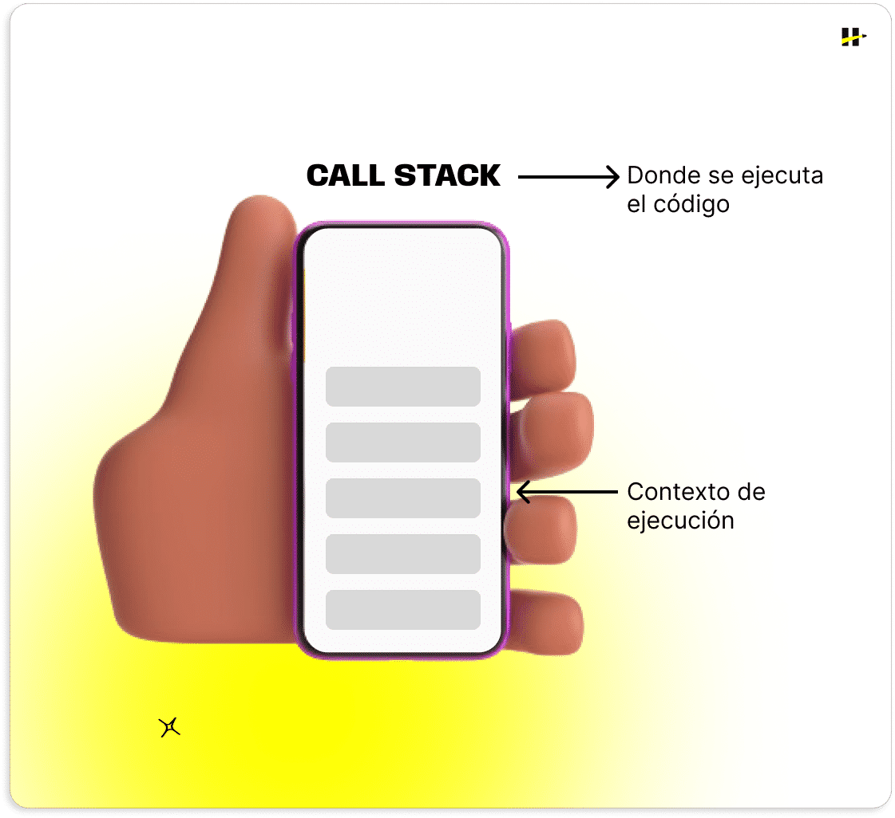
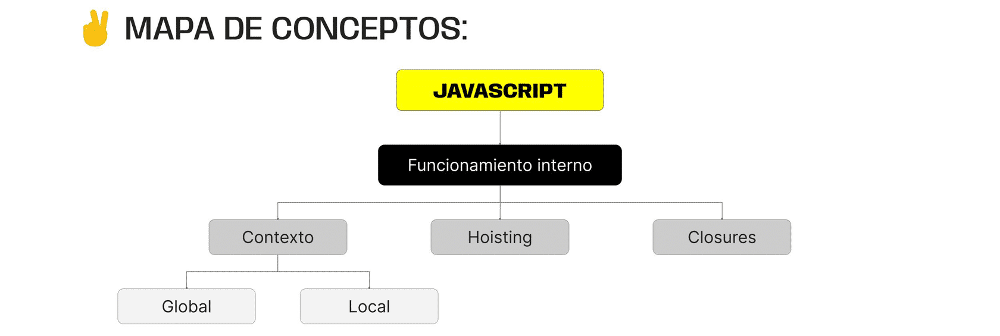

> # ***Modulo 2 - Clase 14: JavaScript Avanzado***

> ## ***Objetivos***

* ### *Comprender el concepto de contextos y entornos de ejecución en JavaScript.*

* ### *Analizar el comportamiento del hoisting y entender cómo afecta a las variables y funciones en el código.*

* ### *Familiarizarse con el concepto de closures y entender cómo se crean en JavaScript.*

* ### *Reconocer los beneficios prácticos de los closures en la encapsulación de datos y la creación de funciones especializadas.*

> ## ***Contextos y entornos***

* ### **Conceptos clave**

  El tiempo de ejecución de los programas (runtime) y el motor de ejecución de código, hacen referencia al entorno donde se ejecutan nuestros scripts. Dentro de esos elementos cabe destacar dos piezas muy importantes:

  * #### ***Memory Heap:*** Es la región o espacio de memoria de tu PC en la que se asignan variables cuando las creas. Allí se almacenan los datos creados durante la ejecución, como objetos, arrays y variables.
    
  * #### ***Call Stack:*** Es el mecanismo que organiza la ejecución de las funciones en una aplicación. Apila los entornos en los que cada fragmento de tu código se ejecuta.

* ### **¿Cuál es su relación?**

  En el call stack, cada vez que se llama a una función, se añade un nuevo contexto en la parte superior de la pila que contiene toda la información sobre la función en curso. Al completarse la ejecución de dicha función, se elimina su contexto de la pila. El flujo de apilar y des-apilar contextos de ejecución determina el comportamiento del código.

  

  De esta manera, al momento de ejecutar una función, se crea un nuevo contexto de ejecución y se carga en el memory heap toda la información contenida dentro la función como variables, parámetros y otros detalles. Una vez esta función termina de ejecutarse, el contexto de ejecución se destruye y continúa con el siguiente contexto de la call stack.

  

* ### **Global vs. Local**

  * #### **Global**
    
    El contexto de ejecución global es el ámbito en el que está escrito el código fuera de cualquier función o bloque específico. En este contexto las variables y funciones se definen y pueden ser accedidas desde cualquier parte del código, ya sea usar los valores de las variables o ejecutar las funciones desde dentro de otras funciones.

    ```javascript
    let variable = 'string'; // <-- Ámbito global

    function exampleOne() {
      let variableOne = 'string'; // <-- Ámbito local (función exampleOne)
    };

    function exampleTwo() {
      let variableTwo = 'string'; // <-- Ámbito local (función exampleTwo)
    };
    ```
    
  * #### **Local**

    El contexto de ejecución local se refiere al entorno en el que se ejecuta un bloque de código específico, generalmente dentro de una función o un bloque delimitado por llaves "{ }". Dentro de este contexto local, las variables y funciones declaradas son accesibles solo dentro de ese bloque y no fuera de él.

    ```javascript
    function miFuncion() {
      let miVariable = 'string';
    };
    console.log(miVariable) // <-- undefined
    ```

* ### **Ámbito léxico**

  Cuando hablamos de ámbito o alcance léxico, nos referimos al contexto en el que se busca y se resuelve el valor de una variable. En otras palabras, donde estas pueden ser referenciadas y qué valores tienen.

> ## ***Hoisting***

* ### **¿Qué es?**

  El proceso de hoisting consiste en un comportamiento de JavaScript. En este, las declaraciones de variables y funciones son "movidas" o “elevadas” internamente al inicio de su ámbito léxico antes de que el código comience a ejecutarse. Este comportamiento nos permite acceder a dichas variables o funciones antes de su declaración sin generar errores.

  A pesar de que el hoisting parece ser de gran utilidad, y en algunas situaciones ocurre sin que tengamos conciencia de este, las buenas prácticas de código indican que debe ser evitado su uso de forma intencional procurando declarar siempre variables con let y const y declarando funciones antes de su ejecución.

> ## ***Closures***

* ### **¿Qué es?**

  Las closures son funciones que tienen acceso a variables definidas en su ámbito léxico, incluso luego de haber terminado su ejecución.

  En otras palabras, es la capacidad que posee una función de recordar y acceder a variables de su ámbito léxico, aun que esta ya se haya terminado de ejecutar.

  Las closures se crean cuando una función es declarada dentro de otra y la función interna hace referencia a variables de la externa.

  Una closure es la posibilidad que tiene una función “hija” (función retornada por otra) de recordar todas las variables de la función “padre” que existían en el momento de su ejecución, incluso después de que la función padre haya retornado y eliminado del call stack.

  ```javascript
  function funcionPadre() {
    let variableExterna = "Soy externa";

    function funcionRetornada() {
      console.log(variableExterna)
    };

    return funcionRetornada;
  };

  const funcionHija = funcionPadre();
  funcionHija(); // "Soy externa"
  ```
***
> ## ***Cierre***

* ### **En conclusión...**

  * ***La comprensión del contexto, hoisting y closures en JavaScript:*** Son esenciales para los desarrolladores que buscan comprender el comportamiento interno del lenguaje.

  * ***El Contexto:*** Se refiere al entorno en el que se ejecuta el código y los hay de dos tipos: global y local.

  * ***El hoisting:*** Es el comportamiento por el cual las declaraciones de variables y funciones se mueven internamente hacia arriba en el código para evitar errores.  
    Las variables declaradas con var son elevadas (hoisted) y las funciones declaradas también son elevadas junto con sus definiciones completas.

  * ***Las Closures:*** Son funciones que tienen acceso a variables de un contexto externo, incluso después de que la función externa haya finalizado su ejecución.

  
***