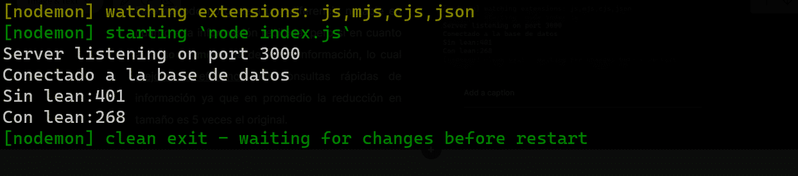
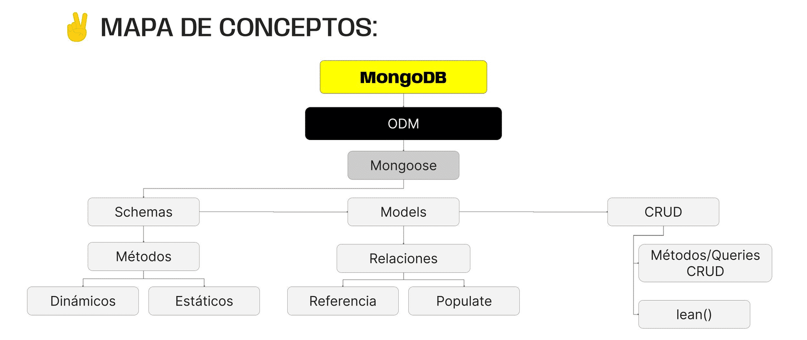

> # ***Modulo 2 - Clase 12: Mongoose II***

>## ***Objetivos***

* ### *Familiarizar al alumno con las queries más comunes de mongoose.*

* ### *Entender cómo se generan y cómo utilizar las referencias.*

* ### *Aprender como utilizar la population.* 

* ### *Profundizar en algunos trucos útiles de mongoose.*

> ## ***Queries***

* ### **¿Qué es?**

    En el contexto de las bases de datos, una query es una solicitud de información específica a la base de datos.

    Dicha query se utiliza para buscar, crear, actualizar o eliminar datos de acuerdo a ciertos criterios que pueden estar definidos dentro de la misma query. En otras palabras, es una instrucción para realizar una acción en la base de datos.

* ### **[Actualización por operadores](https://www.mongodb.com/docs/manual/reference/operator/query-comparison/)**

    Cuando actualizamos documentos podemos hacer que esta actualización sea definida mediante operadores de comparación, en lugar de que lo haga el cliente. Los operadores de comparación son códigos que nos permiten realizar la comparación de los datos recibidos con una condición específica.

    Por ejemplo, supongamos que queremos incrementar la edad del autor ‘Gabriel García Márquez’ en 5 años. Para esto, vamos a definir una nueva ruta put que reciba el nombre del autor por query y busque la coincidencia para actualizar.

    ```javascript
    app.put("/increment", async (req, res) => {
      try {
          const {name} = req.query;
          const author = await Author.findOneAndUpdate(
              {name: name}, {$inc: {age: 5}}, {new: true}
          );

          res.json(author);
      } catch (err) {
          res.status(500).json({message: err.message});
      }
    });
    // Aquí estamos realizando la actualización del documento utilizando un operador de comparación.
    ```

    En este caso, suponemos que solo habrá un autor con este nombre, por lo que utilizaremos el método findOneAndUpdate() pasándole por argumentos el nombre recibido por query para la consulta, el operador para incrementar la edad del autor ($inc) y la indicación para devolver el documento actualizado.

    Finalmente, respondemos a la solicitud con la nueva información.

* ### **Actualización con validación**

    Supongamos que queremos incrementar la edad de Tolkien. Pero queremos que la actualización se realice solo si su edad es menor a 100, ya que no tendría sentido aumentar más de esta edad.

    Para esto utilizaremos el operador $lt que nos ayude a validar la información. En este ejemplo, evaluaremos si el valor de la edad es menor a 100 años.

    ```javascript
    app.put('/increment', async (req, res) => {
      try {
        const {name} = req.query;
        const author = await Author.findOneAndUpdate(
          {name: name, age: {$lt: 100}},
          {$inc: {age: 5}},
          {new: true}
        );

        res.json(author);
      } catch (err) {
        
        res.status(500).json({message: err.message});
      }
    });
    ```

    Si la propiedad edad del documento cumple esta validación, entonces se realizará la actualización. Caso contrario, no sucederá nada.

* ### **Actualizar o crear**

    Dentro de todos los métodos existe uno llamado findAndUpdate() que nos permite forzar una actualización. En otras palabras, cuando se realiza la búsqueda y no se encuentra el documento no hay nada para actualizar, por lo que se creará. Esta acción es conocida como upsert.

    ```javascript
    app.put("/forceUpdate", async (req, res) => {
      try {
        const { name, age } = req.query;
        const author = await Author.findOneAndUpdate(
          {name: name}, {age: age}, {upsert: true, new: true}
        );
    
        res.json(author);
      } catch (err) {
        res.status(500).json({message: err.message});
      }
    });
    ```

> ## ***Relaciones (referencias)***

* ### **Repasemos las relaciones**

    Cuando trabajamos en MongoDB podemos combinar los datos de diferentes colecciones para generar una estructura de datos que unifique la información.

    Estas relaciones se generan por referencia. En lugar de almacenar toda la información relacionada en un solo documento, almacenamos una referencia al documento relacionado. 

    Esto optimiza la estructura de nuestra base de datos y facilita el manejo de datos relacionados, algo muy similar a cuando hablamos de la normalización de tablas.

> ## ***Populación***

* ### **Población de Documentos**

    La populación es una técnica que nos permite reemplazar referencias en documentos con los datos reales de los documentos a los que hacen referencia. En otras palabras, podemos acceder a información de otras colecciones que están relacionadas con los documentos que estamos consultando.

    Para ilustrar esta idea, piensa en una colección de Usuarios y otra de Publicaciones correspondientes a una aplicación de blog web. 

    Consideremos que cada documento usuario de la colección Usuarios, posee un campo llamado “publicaciones” que es una referencia a uno o varios documentos de la colección Publicaciones.

    Si deseamos consultar un usuario podemos "poblar" el campo publicaciones, de manera que no veríamos solo la referencia, sino los detalles completos de todas las publicaciones que están asociadas a este.

> ## ***Mongoose Tips & Tricks***

* ### **Método lean**

    El método lean es una herramienta  que nos permite obtener documentos como objetos simples de JavaScript, en lugar de instancias completas de modelos de mongoose.

    Esto puede ser útil cuando necesitamos datos livianos y no planeamos modificar ni guardar los documentos recuperados.

    ```javascript
    const express = require("express");
    const v8 = require("v8");
    const {Author, Book} = require("./src/db");

    app.get("/authors", async (req, res) => {
      try {
        const {name} = req.query;
        if (name) {
          const authors = await Author.findOne({name: name}, "name age");
          const books = await Book.find({author: authors._id}, "title year");
          authors.books = books;
          return res.json(authors);
        }   

        const lightAuthors = await Author.find().select("name age").lean();

        const authors = await Author.find();

        console.log("Sin Lean: ", v8.serialize(authors.map(a => a.toJSON())).length);
        console.log("Con Lean: ", v8.serialize(lightAuthors).length);

        res.json(authors);
      } catch (err) {
        res.status(500).json({message: err.message});
      }
    });
    // Esto es solo de forma ilustrativa no es necesario que lo utilices.
    ```

    En esta función hemos realizado la búsqueda de información con y sin el método lean(). 

    En este caso no es importante lo que está haciendo el código sino la comparación de tamaño en bits de la respuesta que obtenemos al serializarlas con el método serialize de v8.

    Este método no genera una diferencia notable en cuanto a la información recibida, pero sí en cuanto al peso en memoria de dicha información, lo cual mejora la eficiencia en consultas rápidas de información ya que en promedio la reducción en tamaño es 5 veces el original.

    

* ### **Métodos estáticos y dinámicos**

    La creación y asignación de métodos que pueden ser asociados a un modelo o esquema. Estos métodos actúan como funciones personalizadas de los modelos. Podemos encontrar 2 variantes:

    * ***Métodos Estáticos:*** Los métodos estáticos son funciones que aplicamos directamente al modelo y no a instancias específicas. Son útiles para realizar operaciones que afectan a toda la colección o que no se vinculan a ningún documento en específico.
    
        * **Creación**
            
            Tomemos la lógica que busca libros mediante el id de un autor.  Esto lo guardaremos como un método llamado findBooksByAuthor.

            Para crearlo, solo tendremos que acceder a la propiedad statics del schema,  y lugo generar la función.

            ```javascript
            bookSchema.statics.findBooksByAuthor = async (authorId) => {
              const books = await this.find({ author: authorId }, "title year");
              return books
            };
            ```

        * **Uso**
            
            Esto nos permitirá utilizar el método findBooksByAuthor dentro del modelo books y replicar su funcionamiento.

            ```javascript
            app.get("/authors", async (req, res) => {
              try {
                const {name} = req.query;
                if (name) {
                  const authors = await Author.findOne({name: name}, "name age");
                  const books = await Book.findBooksByAuthor(authors._id);
                  authors.books = books;
                  return res.json(authors);
                }
        
                const authors = await Author.find();
                res.json(authors);
              } catch (err) {
                res.status(500).json({message: err.message});
              }
            });
            ```
        
    * ***Métodos Dinámicos:*** Los métodos dinámicos, a diferencia de los estáticos, se aplican a instancias específicas del modelo. Son útiles para realizar operaciones concretas en documentos individuales, sin afectar los demás documentos.

        * **Creación** 

            Para poder declarar un método dinámico accederemos a la propiedad methods del schema al que queremos asociar el método y asignaremos el nombre y código de la función deseada. 

            Al ser un método dinámico podemos utilizar la palabra clave this para acceder a los valores de la instancia específica sobre la cual estamos trabajando.

            ```javascript
            authorSchema.methods.printBook = async (books) => {
              console.log(`El autor ${this.name} tiene estos libros ${this.books}`);
            };
            ```

        * **Uso**

            Esto nos permitirá utilizar el método printBook para imprimir un string en consola con la información de la instancia recibida.

            ```javascript
            app.get("/authors", async (req, res) => {
              try {
                const {name} = req.query;
                if (name) {
                  const authors = await Author.findOne({name: name}, "name age");
                  const books = await Book.findBooksByAuthor(authors._id);
                  authors.books = books;
                  authors.printBook();
                  return res.json(authors);
                }

                const authors = await Author.find();
                
                res.json(authors);
              } catch (err) {
                res.status(500).json({message: err.message});
              }
            });
            ```
***
> ## ***Cierre***

* ### **En conclusión...**

  * ***Profundizamos más en mongoose y las herramientas que lo componen:*** Vimos los principales métodos para hacer consultas, crear, eliminar o actualizar datos basada en ciertas condiciones.

  * ***Exploramos las relaciones por Referencia:*** Que permiten vincular documentos de distintas colecciones mediante referencias en los schemas, facilitando la estructuración de documentos que se enlazan unos con otros.

  * ***Conocimos el método populate:*** Que permite reemplazar referencias a documentos por datos más detallados de los documentos relacionados a otros sobre los que se consulta. Esto flexibiliza las queries y evita llevar a cabo múltiples consultas separadas para obtener la misma información solicitada.

  * ***Descubrimos el método lean:*** Que proporciona documentos como objetos de JavaScript, en lugar de instancias de modelos Mongoose. Introdujimos los métodos estáticos, que afectan a todas las instancias del modelo, y los dinámicos, que solo alteran instancias concretas que nosotros escojamos.

  